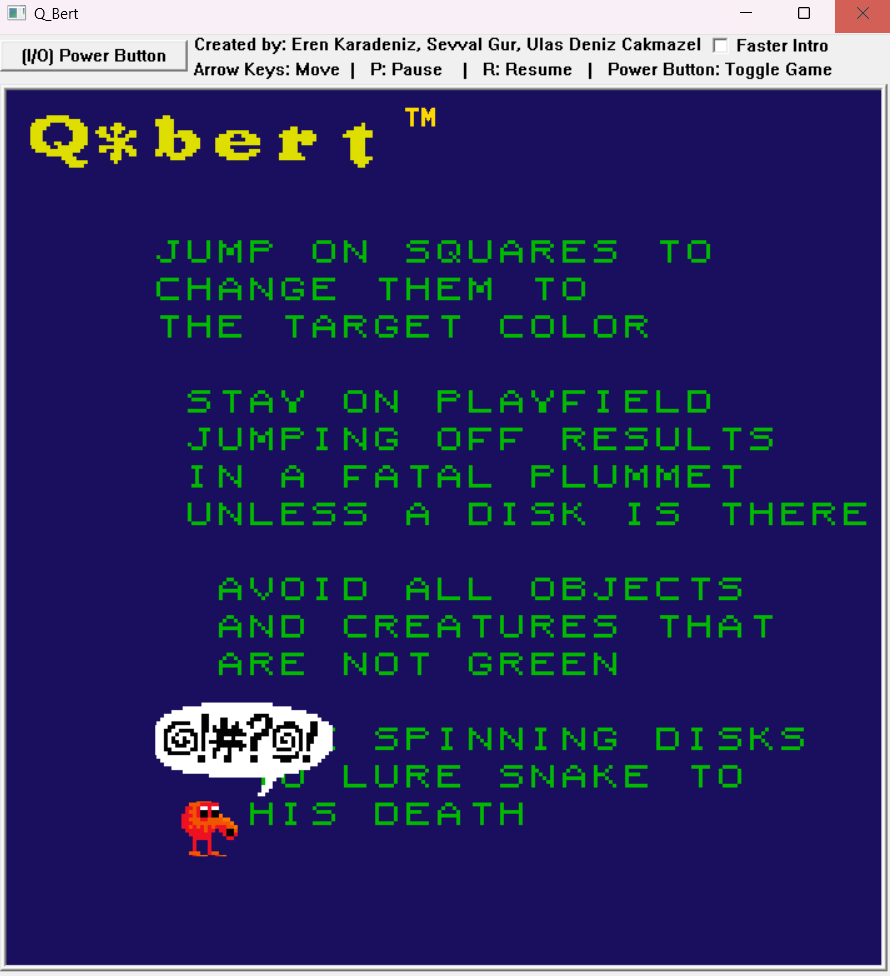

Here is a sample `README.md` for the Qbert project written in C++ using the ICbytes library:

```markdown
# Qbert Game

This is a C++ implementation of the classic Qbert game. The game is built using the **ICbytes** library, providing a platform to manage various functionalities like graphics, input handling, and more. The game includes several core features such as animations, sound effects, and player interaction.

## Features

- **Character Animations**: Moving animations for the main character, Qbert, as well as turning and jumping effects.
- **Enemy Movements**: Includes enemy snake-like movements with animations.
- **Sound Effects**: Background music, character sounds, enemy sounds, and game events (e.g., victory, intro, game over).
- **Highscore Tracking**: A highscore system to track the best player performances.
- **Game States**: Includes different states such as pause, game over, and victory states.
- **Player Interaction**: Controls for Qbert, including movement and jumping.
- **Block Interactions**: Block movements and animations with collision handling.
- **Multithreading**: Utilizes threads for managing different parts of the game such as enemy movements and sound systems.

## Installation

1. Clone this repository to your local machine:
   ```bash
   git clone https://github.com/ErenKaradeniz0/Q_bert.git
   ```

2. Install the **ICbytes** library if it's not already installed:
   - Visit [ICbytes official documentation](https://otoidrak.com/doc/I-See-Bytes%20A%20Simplified%20C++%20Library.pdf) for installation instructions.
   - Visit [ICbytes Main Page](https://otoidrak.com/Yazilim.html)

## Images





## Gameplay

- **Movement**: Use arrow keys or WASD to move Qbert.
- **Jumping**: Press the space bar to make Qbert jump to the next block.
- **Enemies**: Avoid the enemies that move across the grid. If you collide with them, you lose a life.
- **Objective**: Complete the game by jumping on all the blocks while avoiding the enemies.

## Game Controls

- **Arrow Keys** / **WASD**: Move Qbert.
- **Space Bar**: Jump to the next block.
- **Esc**: Pause or resume the game.

## Acknowledgements

- **ICbytes Library**: For providing a simple way to handle graphics and input in C++.
- **Original Qbert Game**: For inspiration, we recreate the classic game.

   
## Contributors

👤 **Eren Karadeniz** - [GitHub](https://github.com/ErenKaradeniz0)  
👤 **Ulas Deniz Cakmazel** - [GitHub](https://github.com/UlasDenizCakmazel)  
👤 **Sevval Gur** - [GitHub](https://github.com/svvlgr)  

## License

📜 This project is licensed under the MIT License.
